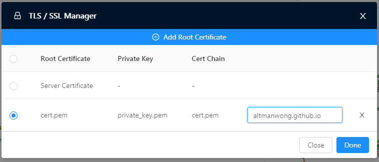

近來工作上用到 `gRPC` 需要起一隻 `gRPC Server` 夾 `NGINX` 做 `LOAD BALANCING` 搞到頭都大先整得好 特此記錄一下

## NGINX Setup

以下會用上 `Docker + NGINX 1.21.0, gRPC port = 12345` 做例子

`gRPC` 底層其實係 `HTTP/2` 來 而 `HTTP/2` 本來就係 `TCP` 以常理黎講應該就可以直接用 `TCP SSL STREAM` 既方式去做 `REDIRECT`
```
stream {
    server {
        listen               12345 ssl;
        ssl_certificate      ${SSL_CERT};
        ssl_certificate_key  ${SSL_KEY};
        ssl_protocols        TLSv1 TLSv1.1 TLSv1.2;
        proxy_pass           ${UPSTREAM}:12345;
    }
}
```
正當我滿心歡喜SET好晒啲野諗著淡淡定有錢剩既時候，一用個 `BloomRPC` 隊埋去就出句咁既野
```log
"error": "14 UNAVAILABLE: failed to connect to all addresses"
```

仆街喇點解唔得架呢

Check埋 `NGINX` 都係唔WORK，搵左一輪發現原來唔可以咁寫個 `nginx.config` 相信係同 `HTTP/2 TCP multiplexing` 有關。而想係 `NGINX` 入面做 `gRPC` PORT FORWARDING 我地既 config 要咁寫。
```
http {
    server {
        listen               12345 ssl http2;
        ssl_certificate      ${SSL_CERT};
        ssl_certificate_key  ${SSL_KEY};
        location / {
            grpc_pass        ${UPSTREAM}:12345;
        }
    }
}
```

再用 `BloomRPC` 隊多次埋去，失敗。係呢個時候都係要睇埋 NGINX 既LOG
```log
client node disconnected
```

即係駁到埋去但係比人彈番轉頭
之後再搵下點解 原來 gRPC 既 call 係 TLS 之下冇得就咁用 Server Authentication, 需要入番張 Cert 落去先得



最緊要係要入番個 CA 落去 (圖中既 altmanwong.github.io, 張張 cert 都唔同) 唔係call多10次都係會call唔到

## Client side

Client Side 會用 `C#` + `gRPC.Core` 做例子

本來打算就咁寫就算
```csharp
public Channel GetChannel() {
    return new Channel(GetServiceUrl(), ChannelCredential.SecureSsl);
}
```

見到咁簡單，以為輕輕鬆鬆又過到關。點知起機一試吉埋隻 `NGINX` 到又係爆炸冇反應。

如果用番 `BloomRPC` 嘅 config 去睇，我地上面段CODE冇左幾樣野:
1. Server Cert
2. SSL Name (又稱CN)

問題就黎喇，我嘅 Client Side 根本就唔會有 Server Cert 係到。咁點做 Authentication 呢？

## 偷CERT
係張 Cert 唔係 Client side 既情況之下唯有用到 `HTTP` 既方法拎張 Cert 落黎，再放番入去 `gRPC Channel` 入面做 `Verification`

首先要做一個 HttpWebRequest 行埋去 Server
```csharp
try
{
    HttpWebRequest request = (HttpWebRequest)WebRequest.Create(string.Format("https://{0}", GetServiceUrl()));
    request.ServerCertificateValidationCallback = ServerCertificateValidationCallbackHandler;

    HttpWebResponse response = (HttpWebResponse)request.GetResponse();
    response.Close();
}
catch (Exception ex)
{
    // Ignore exception since we do not care about the response
}
```

然後係 `ServerCertificateValidationCallbackHandler` 到接番張 Cert, 再 Load 番佢入去條 `Channel`

```csharp
private bool ServerCertificateValidationCallbackHandler(object sender, X509Certificate certificate, X509Chain chain, SslPolicyErrors sslPolicyErrors)
{
    SslCredential = new SslCredentials(GetPEMCert(certificate));
    ChannelOptionList.Add(new ChannelOption(ChannelOptions.SslTargetNameOverride, GetCnFromSubject(certificate.Subject)));

    if (sslPolicyErrors == SslPolicyErrors.None)
    {
        return true;
    }
    else
    {
        return false;
    }
}

private string GetCnFromSubject(string subject)
{
    Regex cnRegex = new Regex("CN=(.*?),");

    var result = cnRegex.Match(subject);

    if (result.Length > 0)
    {
        return result.Groups[0].ToString().Substring(3, result.Groups[0].ToString().Length - 4);
    }
    else
    {
        return subject;
    }
}

public static string GetPEMCert(X509Certificate cert)
{
    StringBuilder builder = new StringBuilder();

    builder.AppendLine("-----BEGIN CERTIFICATE-----");
    builder.AppendLine(Convert.ToBase64String(cert.Export(X509ContentType.Cert), Base64FormattingOptions.InsertLineBreaks));
    builder.AppendLine("-----END CERTIFICATE-----");

    return builder.ToString();
}
```

著機吉埋去，BOOOOOOOOOOOOOOOOOOOOOOOM 有野睇了。